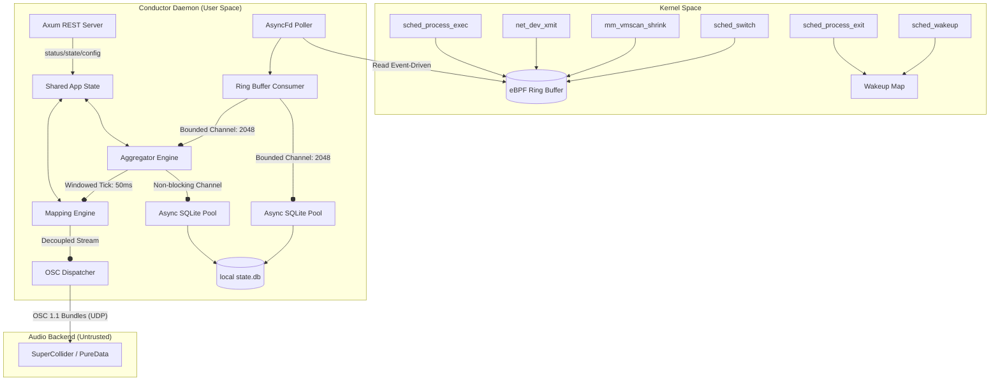

# DAEMON CHOIR — Real-time Linux Kernel-State-to-Sound Daemon

[](https://kernel.org)
[](https://github.com/aya-rs/aya)
[](https://www.rust-lang.org)
[](#)

DAEMON CHOIR is a local-first, privacy-preserving systems telemetry sonification engine for Linux. It taps into low-level kernel events (CPU scheduling, memory reclaim pressure, network I/O, and process lifecycle) using lockless **eBPF ring buffers**, processes them through a decoupled, bounded userspace pipeline, and maps them in real time into generative audio control streams via **Open Sound Control (OSC)**.

The entire system runs locally on the loopback interface with **no cloud dependencies, no network telemetry exfiltration, and no plaintext capture of process or user names**.

---

## 1. System Architecture

DAEMON CHOIR is engineered as a decoupled, multi-threaded pipeline designed to isolate the high-throughput, latency-critical telemetry path from slower database persistence and API handlers. This design guarantees the core invariant: **internal processing or storage errors will never block, jitter, or interrupt the real-time audio control output.**

### Architectural Diagram



---

## 2. Telemetry Engine & eBPF Probes

DAEMON CHOIR utilizes four kernel-space tracepoint probes to capture system activity:

1. **CPU Scheduler Latency (`cpu_sched`)**:
   * **`sched/sched_wakeup`**: Captures when a process becomes ready to run, recording a timestamp in a BPF hash map keyed by its PID.
   * **`sched/sched_switch`**: Captures when the scheduler runs. For the incoming process, it calculates queue latency ($t_{sched\_switch} - t_{sched\_wakeup}$), reports it, and deletes the map entry.
   * **`sched/sched_process_exit`**: Captures process termination to clean up orphans in the wakeup map, preventing memory leaks and table saturation.
2. **Memory Reclaim Pressure (`mem_pressure`)**:
   * **`vmscan/mm_vmscan_shrink_inactive_to_succ`**: Captures the exact count of pages reclaimed during inactive scanning and reports the NUMA Node ID (`nid`) as the zone indicator.
3. **Network I/O Bandwidth (`net_io`)**:
   * **`net/net_dev_xmit`**: Captures outgoing packet sizes. It hashes the network interface name directly in kernel space and reports the transmit length in bytes.
4. **Process Lifecycle (`proc_lifecycle`)**:
   * **`sched/sched_process_exec`**: Captures new program executions, hashing the process name and UID in kernel space before sending them to userspace.

### eBPF Compile-Once-Run-Everywhere (CO-RE) Portability
To allow compatibility across various Linux kernel versions, the BPF C programs do not rely on local kernel header configurations. The tracepoint structures are minimally declared in BPF code and annotated with `__attribute__((preserve_access_index))`:
```c
struct trace_event_raw_sched_switch {
    char prev_comm[16];
    char next_comm[16];
    int next_pid;
} __attribute__((preserve_access_index));
```
This attribute generates CO-RE relocations in the compiled ELF object. The userspace loader (Aya) dynamically maps the exact offsets of the target kernel's struct fields at load time, ensuring safety even if field ordering changes in newer kernels.

### Privacy-by-Design Hashing
To prevent exfiltration of sensitive PII (like process names or usernames), command strings and UIDs are anonymized directly inside kernel-space via a 64-bit FNV-1a hash before being copied to the ring buffer:
```c
static __always_inline u64 fnv1a_64_hash(const char *str) {
    u64 hash = 0xcbf29ce484222325ULL;
    for (int i = 0; i < 16; i++) {
        if (str[i] == '\0') break;
        hash ^= (u64)(str[i]);
        hash *= 0x100000001b3ULL;
    }
    return hash;
}
```

---

## 3. Userspace Concurrency Pipeline

The user-space daemon (`conductor`) utilizes Tokio to build a highly parallelized pipeline:

### Event-Driven Async Polling
Instead of using CPU-heavy active sleep loops to query eBPF maps, the loader wraps the eBPF ring buffer file descriptor inside `tokio::io::unix::AsyncFd`. The consumer task suspends asynchronously and is reactivated by the Tokio selector *only* when the kernel signals that the ring buffer has data, maximizing CPU efficiency and eliminating artificial polling latency:
```rust
let mut async_fd = AsyncFd::new(ringbuf)?;
while let Ok(mut guard) = async_fd.readable().await {
    while let Some(item) = guard.get_mut().next() {
        // Safe memory-unaligned deserialization
        let event = unsafe { std::ptr::read_unaligned(...) };
        tx.try_send(event)?;
    }
    guard.clear_ready();
}
```

### Metrics Aggregator (EMA)
The raw telemetry events are accumulated inside rolling windows (default: `50ms`). At each tick, the aggregator computes the p95 scheduling latency and rates for context switching, memory page reclaim, net traffic, and process executions. It smooths these metrics using an **Exponential Moving Average (EMA)** to filter out high-frequency noise before normalizing them to a `[0.0, 1.0]` range:

$$\text{EMA}_t = \alpha \cdot \text{Value}_t + (1 - \alpha) \cdot \text{EMA}_{t-1}$$

* **Stale State Detection**: If no raw events are received for $5$ consecutive windows, the aggregator marks the system state as `stale` and sets output metrics to baseline values to avoid retaining outdated telemetry.

### Non-Blocking Persistence
Telemetry snapshots are recorded locally in a SQLite database. To ensure disk write latencies (which can block for tens of milliseconds) never affect the real-time audio stream, the Database runs on a separate thread pool. The aggregator dispatches database updates via non-blocking channels. If the SQLite pool queue fills up, snapshots are dropped rather than delaying the audio mapping loop.
* **Retention Policy**: A background task cleans up metrics older than 24 hours every hour.

---

## 4. OSC Mapping & Synthesis

The Normalized telemetry metrics (`[0.0, 1.0]`) are mapped to OSC control parameters using one of four mathematical transformations configured by the user:

1. **Linear**: Maps input range directly to output range.
2. **Exponential**: Best for frequency/pitch mapping (1V/octave behavior).
3. **Logarithmic**: Best for amplitude/volume scaling to match human perception.
4. **Step**: Divides input into discrete steps (useful for triggering pitch classes or sequences).

### Network Jitter & Timetags
All parameters computed for a specific window are grouped into a single **OSC 1.1 Bundle** containing an NTP timetag (32-bit seconds, 32-bit fraction) representing the exact system time of the telemetry sample. This allows downstream synthesizer engines to buffer and schedule execution, resolving network-induced packet jitter.

### SuperCollider Synthesis Template
Save the following code as `choir.scd` and execute it in SuperCollider to begin synthesizing the kernel's behavior:

```supercollider
s.boot;

(
// Define synthesizer voices
SynthDef(\telemetryVoice, { |out=0, freq=440, amp=0.0, filterFreq=1200, res=0.5, gate=1|
    var env = EnvGen.kr(Env.asr(0.01, 1, 0.1), gate, doneAction: 2);
    var osc = Saw.ar(Lag.kr(freq, 0.05)) * Lag.kr(amp, 0.05);
    var filter = MoogFF.ar(osc, Lag.kr(filterFreq, 0.05), res);
    Out.ar(out, filter * env ! 2);
}).add;

SynthDef(\percussiveTrigger, { |out=0, amp=0.0|
    var env = EnvGen.kr(Env.perc(0.005, 0.2), doneAction: 2);
    var noise = WhiteNoise.ar(amp * 0.4) + SinOsc.ar(60, 0, amp * 0.6);
    Out.ar(out, noise * env ! 2);
}).add;
)

(
// Instantiate voices
~freqVoice = Synth(\telemetryVoice, [\freq, 220, \amp, 0]);
~memVoice = Synth(\telemetryVoice, [\freq, 110, \amp, 0.15, \filterFreq, 400]);
~netFilter = Synth(\telemetryVoice, [\freq, 330, \amp, 0]);

// Register OSC handlers matching mapping addresses
OSCdef(\freqHandler, { |msg|
    var val = msg[1];
    ~freqVoice.set(\freq, val);
}, '/choir/voice/0/frequency');

OSCdef(\ampHandler, { |msg|
    var val = msg[1];
    ~freqVoice.set(\amp, val * 0.3); // Scale overall volume
}, '/choir/voice/0/amplitude');

OSCdef(\memHandler, { |msg|
    var val = msg[1];
    ~memVoice.set(\freq, val);
}, '/choir/voice/1/frequency');

OSCdef(\netResHandler, { |msg|
    var val = msg[1];
    ~netFilter.set(\res, val);
}, '/choir/voice/2/filter_resonance');

OSCdef(\netFreqHandler, { |msg|
    var val = msg[1];
    ~netFilter.set(\freq, val);
    ~netFilter.set(\amp, 0.2);
}, '/choir/voice/2/frequency');

OSCdef(\execTrigger, { |msg|
    var val = msg[1];
    if(val > 0.1, {
        Synth(\percussiveTrigger, [\amp, val]);
    });
}, '/choir/voice/3/trigger');
)
```

---

## 5. Control REST API

The Conductor exposes a local HTTP REST API at `127.0.0.1:9876` for hot-reloading configurations, fetching live telemetry dashboard stats, and managing daemon lifecycles.

### API Specifications
Authoritative OpenAPI specification is located in [docs/api/control-api.openapi.yaml](file:///Users/macbookprom1pro/Downloads/daemonchoirv6/docs/api/control-api.openapi.yaml).

| Endpoint | Method | Security Headers | Description |
|---|---|---|---|
| `/v1/status` | `GET` | *None* | Returns the package version, git build commit, uptime, list of active backends, and current execution state. |
| `/v1/state` | `GET` | *None* | Returns the current telemetry metrics snapshot. |
| `/v1/voices` | `GET` | *None* | Returns the active parameter mapping rules. |
| `/v1/probes` | `GET` | *None* | Returns statistics for loaded eBPF probes (event count, lost count, last event time). |
| `/v1/config` | `GET` | *None* | Returns the active daemon configuration in JSON. |
| `/v1/config/reload` | `POST` | *None* | Hot-reloads mapping configurations from disk without restarting the daemon. |
| `/v1/config/backends` | `PUT` | *None* | Dynamically updates destination OSC backend configurations. |
| `/v1/metrics` | `GET` | *None* | Exposes Prometheus counters, lost events, and dispatch latency histograms. |
| `/v1/privacy/wipe` | `POST` | `X-Daemon-Choir: wipe` | Wipes all SQLite history. Emits a privacy log. |
| `/v1/shutdown` | `POST` | `X-Daemon-Choir: shutdown` | Shuts down the daemon gracefully. |

---

## 6. Directory Structure

```
daemon-choir/
├── Cargo.toml                    # Cargo workspace configuration
├── Makefile                      # BPF compilation and systems installation scripts
├── crates/
│   ├── daemon-choir-common/      # Shared configuration models, FNV hash functions, BPF definitions
│   ├── conductor/                # Main daemon service target, Axum routes, mapping loop, and SQLite manager
│   ├── daemon-choir-tui/         # Interactive CLI dashboard and ASCII bar visualizer
│   └── ebpf-programs/            # Kernel-space C files compiled to eBPF ELF bytecodes via clang
├── docs/
│   ├── api/                      # OpenAPI Swagger spec files
│   ├── schema/                   # Authoritative JSON configurations schemas
│   └── adrs/                     # Architecture Decision Records (ADR 1 to 6)
├── examples/                     # Ready-to-run SuperCollider synthesis scripts, REST API Python clients, and TOML configuration templates
└── systemd/
    └── daemon-choir.service      # Sandboxed systemd service file
```

---

## 7. Build, Testing & Installation

### Compilation
1. **Compile eBPF Probes (requires `clang`, `llvm`)**:
   ```bash
   make bpf
   ```
2. **Compile Daemon & TUI**:
   ```bash
   cargo build --release --features ebpf
   ```

### Execution Modes
* **Simulation Mode (Portability Fallback)**:
  Runs out-of-the-box on macOS, Windows, and Linux without root privileges. In this mode, the Conductor generates simulated telemetry signals using sine waves and periodic task models:
  ```bash
  cargo run --bin conductor -- --simulate
  ```
* **Real Kernel Mode (Linux-only)**:
  Requires Linux kernel >= 5.8. Run as root or grant network/eBPF capabilities:
  ```bash
  sudo ./target/release/conductor
  ```

### Running Tests
The workspace features unit tests (for FNV-1a hashing, EMA calculations, and linear/step mapping transformations) and integration tests (for isolated database storage, pipeline aggregator stale detection, and REST API routing):
```bash
cargo test
```

### Installation
Install the daemon system-wide under custom systemd sandboxing rules:
```bash
make install
```
Start the user service:
```bash
systemctl --user enable daemon-choir
systemctl --user start daemon-choir
```
Launch the interactive dashboard to verify system operations:
```bash
./target/release/daemon-choir-tui
```

---

## 8. License
GPL-2.0. Copyright (c) 2025 @knarayanareddy. All rights reserved.
